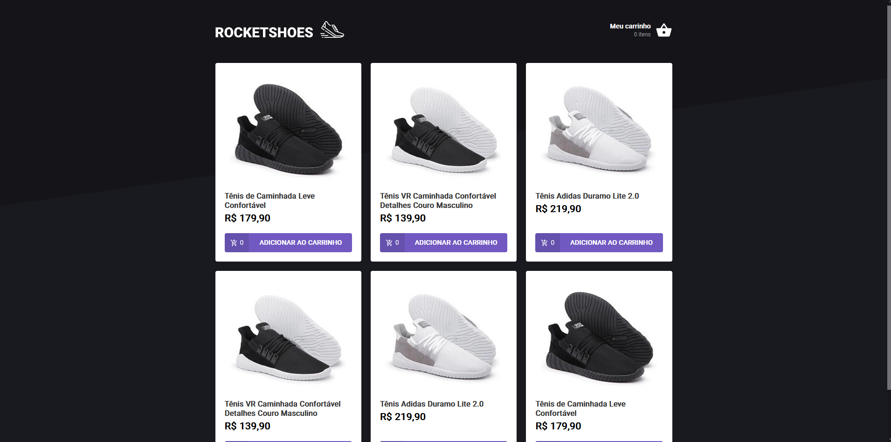
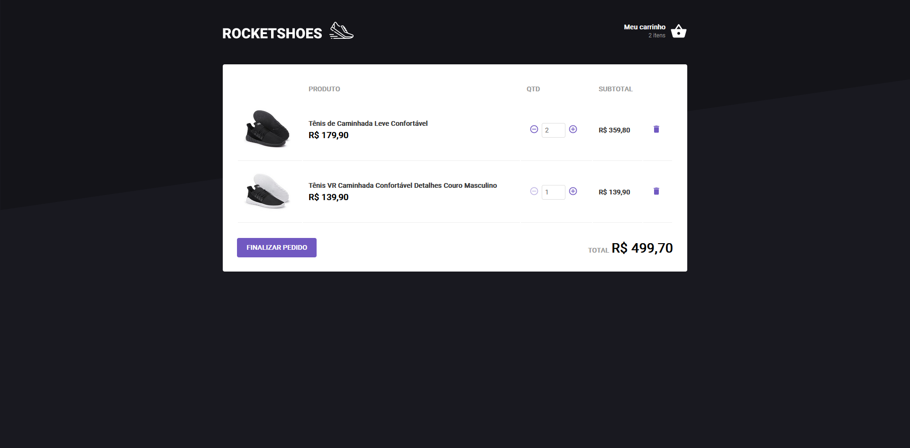

# Rocketshoes

This project is a challenge created on [Ignite Bootcamp](rocketseat.com.br/ignite).

## Some Images

## Goals of challenge

1. Edit file `src/components/Header` to receive an array from hook useCart and display the count of products added on cart.
2. Edit file `src/pages/Home` to receive the products from the fake API and render it and add product on cart when click in "ADICIONAR AO CARRINHO".
3. Edit file `src/pages/Cart` to receive the products added on cart from the hook useCart and render it, and calculate total of products.
4. Edit file `src/hooks/useCart` to create the functions `addProduct`, `removeProduct` and `updateProductAmount`
